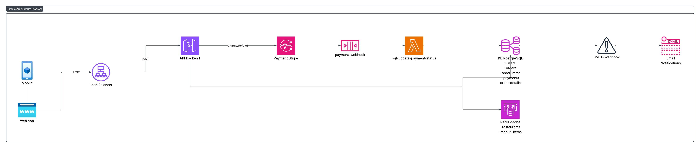

# Architecture

## System Overview



The system follows a modular architecture with clear separation of concerns between business logic, testing, and deployment infrastructure.

# Order Management System


A Python project demonstrating business logic implementation with comprehensive testing, packaging, and CI/CD using GitHub Actions.

## Features

This project implements two core business functions:

1. **Order Total Calculation**: Calculate the total amount of an order including tax
2. **Status Transition Validation**: Validate order status transitions according to business rules

## Project Structure

```
.
├── .github/
│   └── workflows/
│       └── ci.yml          # GitHub Actions CI/CD workflow
├── src/
│   ├── __init__.py
│   └── business.py         # Business logic implementation
├── tests/
│   ├── __init__.py
│   └── test_business.py    # Comprehensive unit tests
├── pyproject.toml          # Project configuration and dependencies
└── README.md               # This file
```

## Installation

### Prerequisites

- Python 3.9 or higher
- pip (Python package installer)
- Git

### Setup

1. Clone the repository:
```bash
git clone https://github.com/yourusername/order-management.git
cd order-management
```

2. Create and activate a virtual environment (recommended):
```bash
# Windows
python -m venv .venv
.venv\Scripts\activate

# Linux/macOS
python -m venv .venv
source .venv/bin/activate
```

3. Install dependencies:

**Option A: Using pyproject.toml (recommended)**
```bash
pip install -e ".[dev]"
```

**Option B: Using requirements.txt**
```bash
pip install -r requirements.txt
```

Both methods will install:
- pytest for testing
- pytest-cov for code coverage

## Usage

### Using the Business Functions

```python
from src.business import OrderItem, calculate_order_total, validate_status_transition

# Calculate order total
items = [
    OrderItem("Laptop", 1, 999.99),
    OrderItem("Mouse", 2, 25.50)
]
total = calculate_order_total(items, tax_rate=0.20)
print(f"Order total: ${total}")

# Validate status transition
is_valid = validate_status_transition("pending", "confirmed")
print(f"Transition valid: {is_valid}")
```

### Valid Order Status Transitions

```
pending → confirmed, cancelled
confirmed → processing, cancelled
processing → shipped, cancelled
shipped → delivered
delivered → (terminal state)
cancelled → (terminal state)
```

## Running Tests

### Run all tests with coverage:
```bash
pytest
```

### Run tests with verbose output:
```bash
pytest -v
```

### Run tests with coverage report:
```bash
pytest --cov=src --cov-report=term-missing
```

### Run tests with HTML coverage report:
```bash
pytest --cov=src --cov-report=html
```

The HTML report will be generated in the `htmlcov/` directory.

### Run specific test files:
```bash
pytest tests/test_business.py
```

### Run specific test classes:
```bash
pytest tests/test_business.py::TestCalculateOrderTotal
```

### Run specific test methods:
```bash
pytest tests/test_business.py::TestCalculateOrderTotal::test_single_item_no_tax
```

## Continuous Integration (CI)

This project uses GitHub Actions for continuous integration. The CI pipeline automatically:

### What the CI Does

1. **Automated Testing**: Runs all tests on every push and pull request
2. **Multi-Version Testing**: Tests against Python 3.9, 3.10, 3.11, and 3.12
3. **Code Coverage**: Generates and reports test coverage
4. **Code Linting**: Checks code quality with flake8
5. **Dependency Installation**: Validates the packaging configuration

### CI Triggers

The CI workflow runs on:
- Push to `main` or `develop` branches
- Pull requests to `main` branch

### CI Guarantees

The CI pipeline guarantees that:
- All tests pass before code can be merged
- Code coverage is tracked and reported
- Code follows Python best practices (linting)
- Package installation works correctly
- Code is compatible with multiple Python versions

### Viewing CI Results

- Check the "Actions" tab in the GitHub repository
- Pull requests show CI status checks
- Green checkmark = all tests passed
- Red X = tests failed or errors occurred

## Git Governance and Branch Protection

This project enforces strict Git governance rules to ensure code quality:

### Branch Protection Rules for `main`

The `main` branch is protected with the following rules:

1. **No Direct Pushes**: All changes must go through Pull Requests
2. **Required CI Checks**: GitHub Actions CI must pass before merging
3. **Code Review Required**: At least 1 approval required before merge
4. **No Force Push**: Force pushing to main is disabled
5. **Up-to-date Branch**: Branch must be up-to-date before merging

### How to Configure Branch Protection

Navigate to your GitHub repository and configure branch protection:

```
Settings → Branches → Add branch protection rule

Branch name pattern: main

Enable:
☑ Require a pull request before merging
  ☑ Require approvals (1)
☑ Require status checks to pass before merging
  ☑ Require branches to be up to date before merging
  Status checks: test, lint
☑ Do not allow bypassing the above settings
```

### Contribution Workflow

1. Create a feature branch:
   ```bash
   git checkout -b feature/your-feature-name
   ```

2. Make your changes and commit:
   ```bash
   git add .
   git commit -m "Description of changes"
   ```

3. Push to GitHub:
   ```bash
   git push origin feature/your-feature-name
   ```

4. Create a Pull Request on GitHub

5. Wait for CI checks to pass

6. Request review from team members

7. After approval and passing CI, merge the PR

## Testing Strategy

The project includes comprehensive tests covering:

### Test Categories

1. **Nominal Cases**: Standard use cases with valid inputs
2. **Edge Cases**: Boundary conditions (zero values, empty lists, etc.)
3. **Error Cases**: Invalid inputs that should raise exceptions
4. **Integration Tests**: Multiple functions working together

### Test Coverage

The project maintains high test coverage:
- `OrderItem` class: 100% coverage
- `calculate_order_total` function: 100% coverage
- `validate_status_transition` function: 100% coverage

## Development

### Code Quality Standards

- Follow PEP 8 style guide
- Write docstrings for all functions and classes
- Maintain test coverage above 90%
- All CI checks must pass

### Adding New Features

1. Write tests first (TDD approach recommended)
2. Implement the feature
3. Ensure all tests pass locally
4. Update documentation
5. Submit a pull request

## Dependencies

### Production
- None (standard library only)

### Development
- pytest >= 7.4.0: Testing framework
- pytest-cov >= 4.1.0: Code coverage

## License

This project is for educational purposes.

## Authors

- @geap1999
- @matinebdi
- @SAIDI-NASSIM 
- @Lotjinn

## Acknowledgments

- Built as a demonstration of Python best practices
- Implements CI/CD with GitHub Actions
- Follows test-driven development principles
